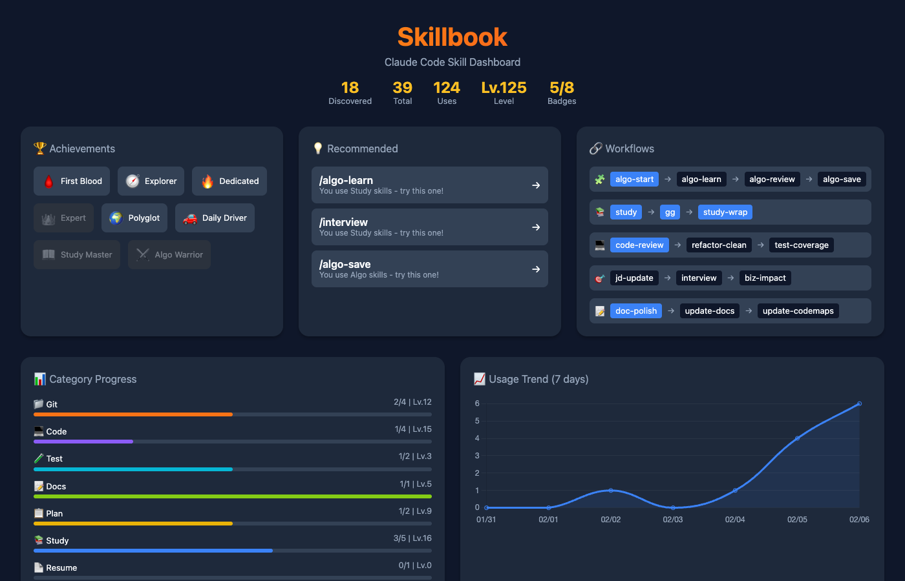
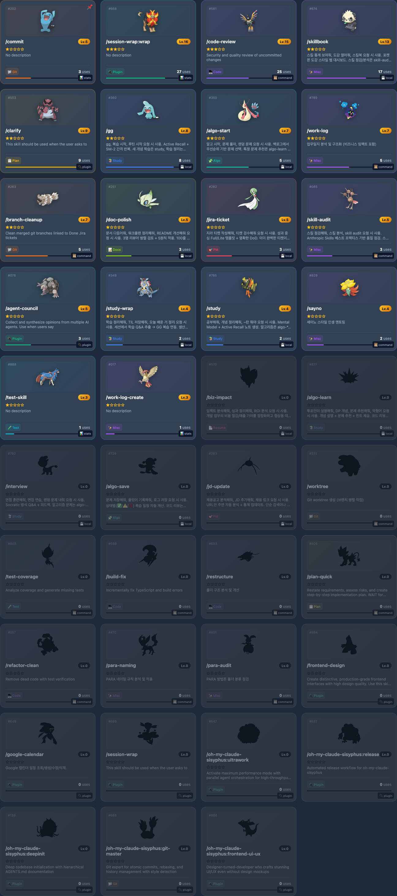
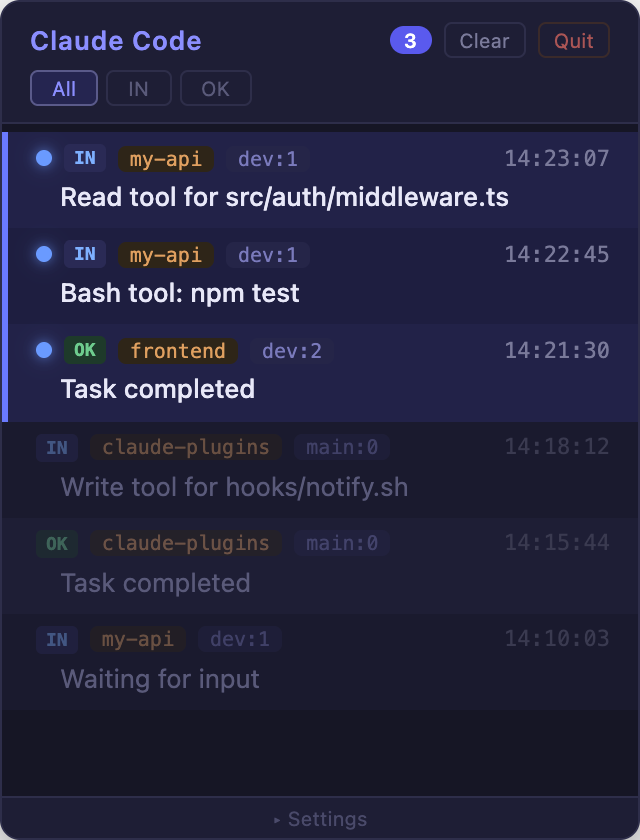

# claude-plugins

A collection of plugins that extend [Claude Code](https://docs.anthropic.com/en/docs/agents-and-tools/claude-code/overview), the terminal-based AI coding agent by Anthropic.

Claude Code supports extensibility through Skills and Hooks, but ships without built-in tools for tracking which skills you actually use, managing notifications across multiple sessions, or validating skill quality before sharing. This repository fills those gaps:

- **Usage visualization** — Track skill usage with a gamified, leveling dashboard
- **Session notifications** — Aggregate alerts from multiple Claude Code sessions in one panel with one-click navigation
- **Publish-readiness audit** — Score skills against a 100-point rubric before sharing

## Quick Start

```bash
# 1. Add marketplace
/plugin marketplace add JeonJe/claude-plugins

# 2. Install a plugin
/plugin install skillbook
```

## Plugins

### [Skillbook](./plugins/skillbook) — Skill Usage Dashboard

Auto-tracks Claude Code skill usage and visualizes it as Pokemon Pokedex-style collectible cards. Skills level up and gain rarity stars the more you use them.

- Hook-based auto-tracking (zero config)
- Leveling system, 5-tier rarity (Common → Legendary), 6 achievements
- Category progress bars, 7-day trend chart, workflow recommendations
- Interactive web dashboard

<details>
<summary>Screenshots</summary>

| Dashboard | Skill Cards |
|:---:|:---:|
|  |  |

</details>

```bash
/plugin install skillbook
/skillbook            # Open dashboard
```

> Requires Python 3.8+, browser

---

### [Claude Notify](./plugins/claude-notify) — Session Notification Panel

A floating macOS notification panel built with Hammerspoon. Collects permission requests, task completions, and other Claude Code alerts in one always-on-top window. Click any notification to jump to the source terminal/tmux pane.

- Always-on-top panel + toast banner
- Type filtering (All / IN / OK)
- Project name and session tags for multi-session identification
- Dark/Light theme, adjustable opacity and font size

<details>
<summary>Screenshots</summary>

| Notification Panel | Toast |
|:---:|:---:|
|  |  |

</details>

```bash
cd plugins/claude-notify && bash setup.sh
```

> Requires macOS, [Hammerspoon](https://www.hammerspoon.org/) (CLI enabled), python3

---

### [Skill Audit](./plugins/skill-audit) — Skill Quality Audit

Scores skills against Anthropic's [skill best practices](https://platform.claude.com/docs/en/agents-and-tools/agent-skills/best-practices) before you publish. Runs a 6-category 100-point rubric plus security anti-pattern checks, then returns an A–D grade with prioritized fixes.

- Trigger quality, body boundaries, token efficiency, and 3 more categories
- Auto-deductions for hardcoded secrets, vague descriptions, missing validation
- Fix → re-audit → verify score improvement loop

```bash
/plugin install skill-audit
/skill-audit my-skill   # Audit a single skill
/skill-audit             # Audit all project skills
```

> No external dependencies

## Contributing

PRs welcome! See each plugin's README for details.

## License

MIT
