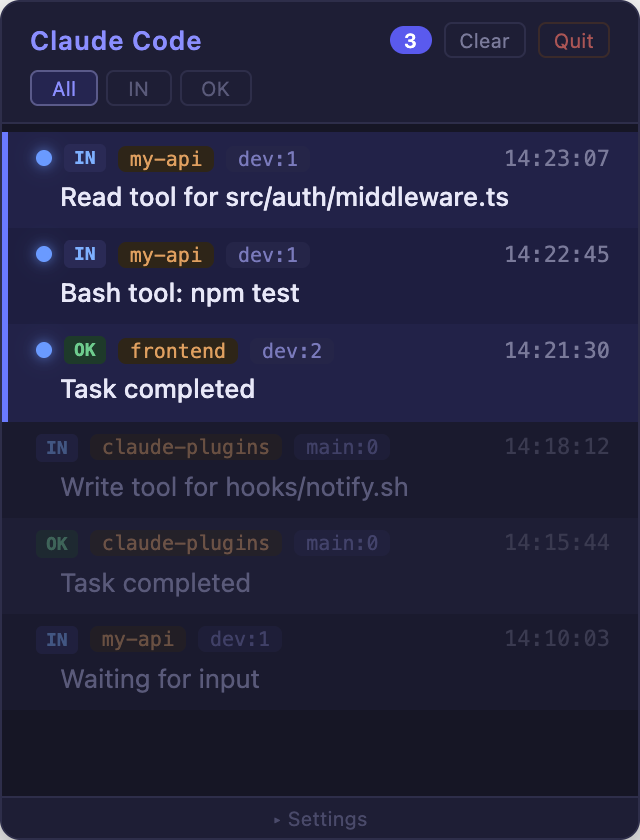

# Claude Notify

Floating notification panel for Claude Code, built with [Hammerspoon](https://www.hammerspoon.org/).

```
Claude Code (Notification/Stop hook)
       |
       v
  notify.sh parses context
       |
       v
  Hammerspoon panel + toast
       |
       v
  Click to jump to terminal/tmux pane
```

## Why

macOS notification center stacks alerts with no context. When running multiple Claude Code sessions, you can't tell which session needs attention or jump to it directly. Claude Notify replaces that with a single always-on-top panel where every notification shows the project, session, and lets you click to navigate.

## Screenshots

### Notification Panel
Always-on-top mini-window with unread indicators, project/session tags, and type filters.



### Toast Banner
Slides down from top center on new notification. Click to jump to source pane.


## Features

### Notification Panel
- Always-on-top mini-window accumulating all Claude Code notifications
- Read/unread tracking with pulsing blue dot + accent border
- Filter by type: **All** / **IN** (input needed) / **OK** (task complete)
- Project name + tmux session tag per notification
- Click any notification to focus the correct terminal/tmux pane

### Toast Banner
- Slides down from top center on new notification
- Auto-dismisses after 4 seconds
- Click to navigate to source pane
- Borderless rounded card with icon + message + project tag

### Contextual Messages

Parses Claude Code's JSON hook context instead of showing generic text:

| Hook Event | Type | Message |
|------------|------|---------|
| Notification | `permission_prompt` | Tool/action name |
| Notification | `idle_prompt` | "Waiting for input" |
| Notification | `elicitation_dialog` | "Question pending" |
| Notification | `auth_success` | "Auth complete" |
| Stop | - | "Task completed" |

Falls back to generic messages if python3 is unavailable.

### Panel Controls

| Control | Description |
|---------|-------------|
| Badge | Unread count |
| All / IN / OK | Filter by type |
| Clear | Remove all notifications |
| Quit | Close panel + stop server |
| Theme | Dark / Light toggle |
| Opacity | 10-100% slider |
| Font | 10-20px slider |

### Other
- Dark / Light theme with one-click toggle
- New notification flash animation
- Adjustable opacity and font size
- Resizable window with minimize/close
- Hotkey toggle (default: Ctrl+Shift+N)
- Works with or without tmux
- Local HTTP only (no external network calls)

## Quick Start

> Requires: macOS, [Hammerspoon](https://www.hammerspoon.org/) (CLI enabled), python3

```bash
git clone https://github.com/JeonJe/claude-plugins.git
cd claude-plugins/plugins/claude-notify
bash setup.sh
```

The setup script auto-detects your environment (terminal, tmux, Hammerspoon path) and generates all config files.

## Usage

```
Claude Code Hook (Notification/Stop)
  -> notify.sh reads JSON context from stdin
    -> python3 extracts notification_type + message
    -> captures tmux session, pane ID, project name
    -> hs -c "ClaudeNotify.push(...)"
      -> Toast slides down + panel updates
        -> Click -> focuses terminal + switches tmux pane
```

Communication uses localhost HTTP (default port 17839).

## Configuration

All settings in `~/.hammerspoon/claude-notify-config.lua`:

```lua
return {
    terminal = "Ghostty",
    hs_path = "/opt/homebrew/bin/hs",
    tmux_path = "/opt/homebrew/bin/tmux",
    use_tmux = true,
    port = 17839,
    hotkey_mods = { "ctrl", "shift" },
    hotkey_key = "n",
    lang = "en",            -- "en" or "ko"
    theme = "dark",          -- "dark" or "light"
    panel = {
        width = 320,
        height = 420,
        alpha = 0.93,
        always_on_top = true,
    },
}
```

Re-run `bash setup.sh` to regenerate, or edit directly and reload Hammerspoon.

---

<details>
<summary>Troubleshooting</summary>

| Problem | Solution |
|---------|----------|
| `hs` command not found | Hammerspoon Preferences > Enable CLI, or `hs.ipc.cliInstall()` |
| Panel doesn't appear | Check `~/.hammerspoon/init.lua` has `require("hs.ipc")` and `ClaudeNotify = require("claude-notify")` |
| Click doesn't navigate | Verify tmux is running and `use_tmux = true` in config |
| Port conflict | Change `port` in both config files, or re-run setup |
| Generic messages | Ensure `python3` is in PATH |
| Toast not showing | Grant Hammerspoon screen recording permission (System Settings > Privacy) |

</details>

<details>
<summary>Uninstall</summary>

Remove from `~/.hammerspoon/init.lua`:
```lua
-- Delete these lines:
ClaudeNotify = require("claude-notify")
```

Remove files:
```bash
rm ~/.hammerspoon/claude-notify.lua
rm ~/.hammerspoon/claude-notify-config.lua
rm ~/.claude/hooks/notify.sh
rm ~/.claude/hooks/notify-config.sh
```

Remove `Notification` and `Stop` hook entries from `~/.claude/settings.json`.

</details>

<details>
<summary>File Structure</summary>

```
# Plugin source
claude-notify/
├── hammerspoon/claude-notify.lua   # Notification panel module
├── hooks/notify.sh                 # Claude Code hook script
├── setup.sh                        # Interactive installer
├── .claude-plugin/plugin.json
└── README.md

# After setup (installed locations)
~/.hammerspoon/
  claude-notify.lua                 # Main module
  claude-notify-config.lua          # Generated config

~/.claude/hooks/
  notify.sh                         # Hook script
  notify-config.sh                  # Generated config
```

</details>

## Requirements

- macOS (Hammerspoon is macOS only)
- [Hammerspoon](https://www.hammerspoon.org/) with CLI enabled
- python3 (optional, for contextual messages)
- tmux (optional, for session navigation)

> This plugin uses Hammerspoon instead of the standard Claude Code skill pattern. Install via `bash setup.sh`, not `/plugin install`.

## License

MIT
