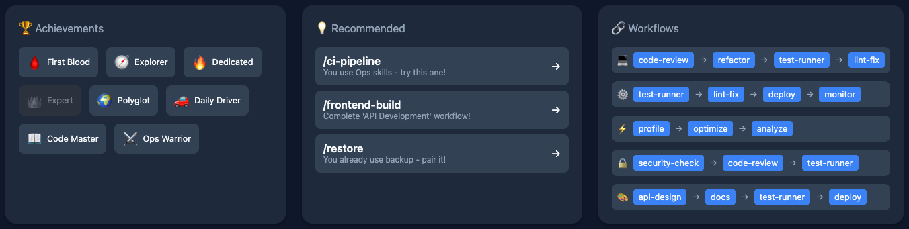

# Skillbook

Pokemon Pokedex-style skill dashboard for Claude Code. Every skill you use becomes a collectible card with levels, rarity, and achievements.

## How It Works

```
1. You use any /skill (e.g., /commit, /study, /interview)
2. Hook auto-tracks usage count in skill-stats.json
3. /skillbook opens a web dashboard showing your collection
4. Skills level up and earn rarity stars as you use them more
```

## Installation

### Step 1: Install Plugin

```bash
# Via marketplace
/plugin marketplace add JeonJe/claude-plugins
/plugin install skillbook

# Or manually
git clone https://github.com/JeonJe/claude-plugins.git
cp -r claude-plugins/plugins/skillbook/skills/skillbook ~/.claude/skills/
```

### Step 2: Enable Auto-Tracking (Required)

Add the usage tracking hook to `~/.claude/settings.json`:

```json
{
  "hooks": {
    "UserPromptSubmit": [
      {
        "hooks": [
          {
            "type": "command",
            "command": "bash ~/.claude/skills/skillbook/hooks/skill-usage-tracker.sh"
          }
        ]
      }
    ]
  }
}
```

> **Note**: If you already have `UserPromptSubmit` hooks, add the new hook entry to the existing array.

After adding the hook, copy it to the skill directory:

```bash
cp -r claude-plugins/plugins/skillbook/hooks ~/.claude/skills/skillbook/
```

### Step 3: Verify

```bash
# Use any skill, then check if it was tracked:
/skillbook stats
```

You should see `Total Uses: 1x` after using your first skill.

## Usage

| Command | Description |
|---------|-------------|
| `/skillbook` | Open web dashboard in browser (default) |
| `/skillbook stats` | Show summary in terminal |
| `/skillbook used` | Show only discovered (used) skills |
| `/skillbook pinned` | Show pinned/favorite skills |
| `/skillbook pin <name>` | Toggle favorite on a skill |
| `/skillbook <category>` | Filter by category (e.g., `study`, `git`, `code`) |

## Screenshots

### Dashboard Overview
Stats, achievements, recommendations, workflows, category progress, and usage trends at a glance.


### Skill Cards
Each skill gets a unique Pokemon sprite. Cards show level, rarity stars, category, and usage count. Undiscovered skills appear as silhouettes.


### Achievements, Recommendations & Workflows
Unlock badges, get personalized skill suggestions, and follow recommended skill sequences.



### Undiscovered Skills
Skills you haven't used yet appear as mysterious silhouettes, waiting to be discovered.


### Skill Detail Modal
Click any card to see detailed stats, level, last used date, and quick copy command.


## Features

### Skill Cards
Each skill gets a unique Pokemon sprite (deterministic hash). Cards show level, rarity stars, category, and usage count.

### Leveling System
```
Level = floor(sqrt(uses * 10))

Example:
  1 use  → Lv.3
  5 uses → Lv.7
  10 uses → Lv.10
  50 uses → Lv.22
  100 uses → Lv.31
```

### Rarity Tiers

| Stars | Tier | Uses Required |
|-------|------|---------------|
| ★★★★★ | Legendary | 100+ |
| ★★★★☆ | Epic | 50-99 |
| ★★★☆☆ | Rare | 20-49 |
| ★★☆☆☆ | Uncommon | 5-19 |
| ★☆☆☆☆ | Common | 1-4 |
| ? | Undiscovered | 0 |

### Achievements
Unlock badges as you reach milestones:

| Badge | Name | Condition |
|-------|------|-----------|
| 🩸 | First Blood | Use your first skill |
| 🧭 | Explorer | Discover 10+ skills |
| 🔥 | Dedicated | Use any skill 10+ times |
| 👑 | Expert | Use any skill 50+ times |
| 🌍 | Polyglot | Use skills from 5+ categories |
| 🚗 | Daily Driver | 100+ total uses |

### Categories
Skills are auto-categorized by keyword matching:

| Category | Keywords | How It Works |
|----------|----------|--------------|
| 📁 Git | commit, pr, branch, worktree, git | If skill name contains "commit" → Git category |
| 💻 Code | code, review, refactor, fix | If skill name contains "review" → Code category |
| 🧪 Test | test, e2e, coverage | If skill name contains "test" → Test category |
| 📝 Docs | doc, update-docs, codemaps | If skill name contains "doc" → Docs category |
| 📋 Plan | plan, issue, clarify | If skill name contains "plan" → Plan category |
| 📚 Study | study, gg, interview, learn | If skill name contains "study" → Study category |
| 📄 Resume | resume | If skill name contains "resume" → Resume category |
| 🧩 Algo | algo | If skill name contains "algo" → Algo category |
| 🎯 PM | jira, jd, ticket, agile | If skill name contains "jira" → PM category |
| 🔌 Plugin | sisyphus, council, calendar | Plugin-related skills |
| ✨ Misc | (no match) | Fallback for unmatched skills |

**Example:** Your skill `/my-code-review` automatically goes to 💻 Code category because it contains "review".

### Web Dashboard
Interactive HTML dashboard with:
- Skill cards with Pokemon sprites
- Search and filter (All / Discovered / Pinned / Local / Commands)
- Sort by uses, level, recent, or name
- Category progress bars
- 7-day usage trend chart
- Achievement badges
- Workflow recommendations
- Click any card for detailed skill info

## Configuration

**Zero config required.** Stats auto-save to `~/.claude/skillbook-stats.json`.

To customize (e.g., sync with Obsidian vault), create `~/.claude/skillbook.config.json`:

```json
{
  "statsFile": "~/path/to/your/skill-stats.json",
  "outputDir": "~/path/to/dashboard/output"
}
```

| Key | Default | Description |
|-----|---------|-------------|
| `statsFile` | `~/.claude/skillbook-stats.json` | Where usage data is stored |
| `outputDir` | `~/.claude/skillbook/` | Where dashboard HTML is generated |

## File Structure

```
skillbook/
├── hooks/
│   └── skill-usage-tracker.sh   # Auto-counts /skill usage (UserPromptSubmit hook)
├── skills/skillbook/
│   ├── SKILL.md                  # Skill definition for Claude
│   ├── skillbook.py              # CLI interface
│   ├── skillbook_dashboard.py    # Web dashboard generator
│   ├── config/                   # Category, level, rarity docs
│   └── templates/                # Card format templates
├── .claude-plugin/plugin.json
└── README.md
```

## Requirements

- Python 3.8+
- `jq` (for hook shell script)
- Browser (for dashboard)
- No Python packages required (stdlib only)

## License

MIT
