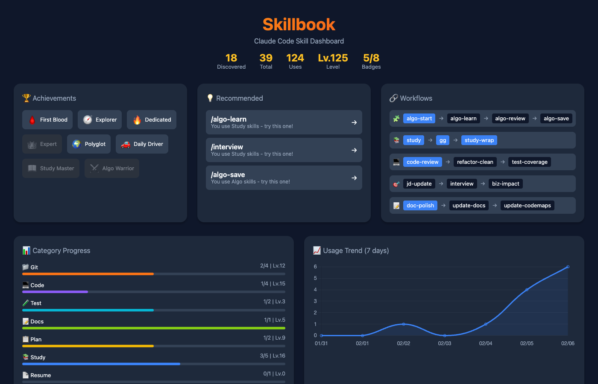
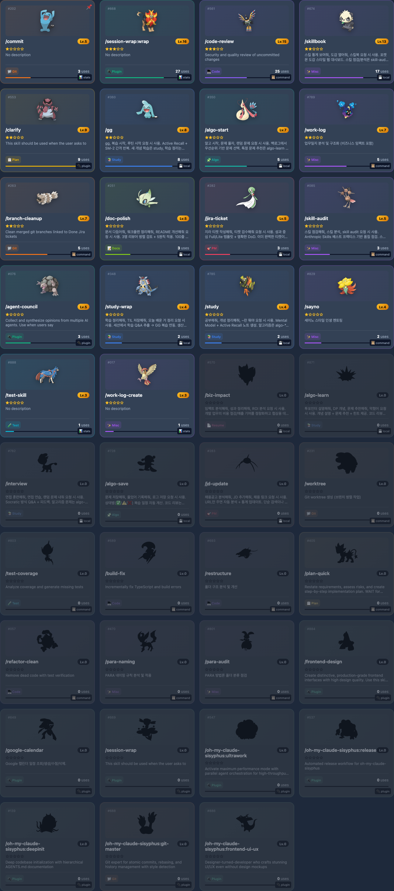
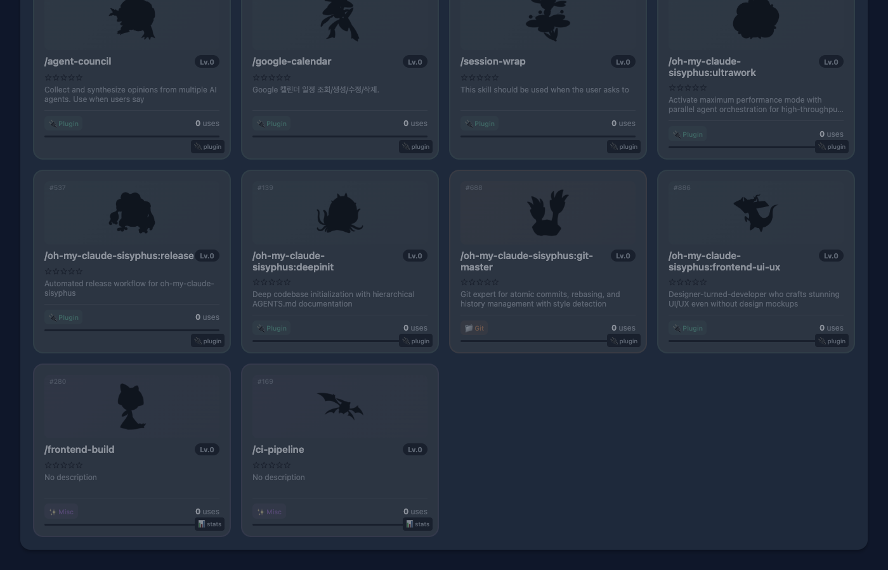
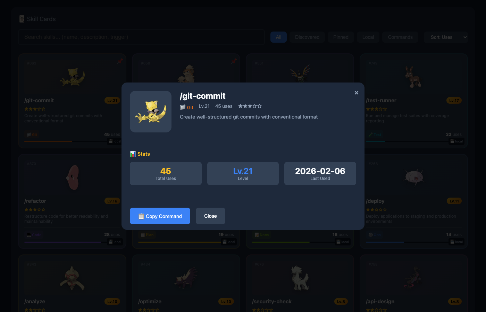

# Skillbook

Pokemon Pokedex-style skill dashboard for Claude Code.

```
/commit, /study, /interview ...
       |
       v
  Hook auto-tracks usage
       |
       v
  /skillbook opens dashboard
       |
       v
  Cards level up + earn rarity stars
```

## Why

Claude Code skills are invisible. You don't know which ones you use most, which you've never tried, or how your usage patterns look over time. Skillbook makes every skill a collectible card with levels and achievements, turning routine usage into a visual progress tracker.

## Quick Start

> Requires: Python 3.8+, Browser

```bash
/skillbook install     # Auto-setup (hooks, config, files)
/skillbook             # Open dashboard
```

No manual configuration needed.

## Screenshots

### Dashboard Overview
Total discovered skills, level, achievements, recommendations, workflow sequences, category progress, 7-day usage trend.



### Skill Cards
Each skill becomes a collectible card with Pokemon sprite, level, rarity stars, category badge, usage count. Undiscovered skills appear as dark silhouettes.




### Skill Detail Modal
Click any card for detailed stats and one-click command copy.



## Features

### Leveling & Rarity

Every skill levels up with usage (`Level = floor(sqrt(uses * 10))`).

| Stars | Tier | Uses |
|-------|------|------|
| ★★★★★ | Legendary | 100+ |
| ★★★★☆ | Epic | 50+ |
| ★★★☆☆ | Rare | 20+ |
| ★★☆☆☆ | Uncommon | 5+ |
| ★☆☆☆☆ | Common | 1+ |
| ? | Undiscovered | 0 |

### Achievements

| Badge | Name | Condition |
|-------|------|-----------|
| 🩸 | First Blood | Use your first skill |
| 🧭 | Explorer | Discover 10+ skills |
| 🔥 | Dedicated | Any skill 10+ uses |
| 👑 | Expert | Any skill 50+ uses |
| 🌍 | Polyglot | 5+ categories used |
| 🚗 | Daily Driver | 100+ total uses |

### Auto-Categorization

Skills are classified by keyword matching in the name:

| Category | Keywords |
|----------|----------|
| 📁 Git | commit, pr, branch, worktree, git |
| 💻 Code | code, review, refactor, fix |
| 🧪 Test | test, e2e, coverage |
| 📝 Docs | doc, update-docs, codemaps |
| 📋 Plan | plan, issue, clarify |
| 📚 Study | study, gg, interview, learn |
| 🧩 Algo | algo |
| 🎯 PM | jira, jd, ticket, agile |
| 🔌 Plugin | sisyphus, council, calendar |
| ✨ Misc | (fallback) |

### Dashboard

Interactive HTML dashboard with search, filter (All / Discovered / Pinned / Local / Commands), sort (uses / level / recent / name), category progress bars, 7-day trend chart, workflow recommendations.

## Usage

| Command | Description |
|---------|-------------|
| `/skillbook` | Open web dashboard (default) |
| `/skillbook stats` | Terminal summary |
| `/skillbook used` | Discovered skills only |
| `/skillbook pinned` | Pinned favorites |
| `/skillbook pin <name>` | Toggle pin |
| `/skillbook <category>` | Filter by category |
| `/skillbook install` | Auto-setup |
| `/skillbook uninstall` | Remove hooks (keeps data) |
| `/skillbook uninstall --purge` | Remove hooks + skill files |
| `/skillbook status` | Installation health check |

## Configuration

**Zero config required.** Optional customization via `~/.claude/skillbook.config.json`:

```json
{
  "statsFile": "~/path/to/skill-stats.json",
  "outputDir": "~/path/to/dashboard/output",
  "language": "en"
}
```

| Key | Default | Description |
|-----|---------|-------------|
| `statsFile` | `~/.claude/skillbook-stats.json` | Usage data location |
| `outputDir` | `~/.claude/skillbook/` | Dashboard HTML output |
| `language` | `en` | `en` or `ko` |

All paths must be under `~`.

---

<details>
<summary>Manual Installation</summary>

```bash
# Via marketplace
/plugin marketplace add JeonJe/claude-plugins
/plugin install skillbook

# Or manually
git clone https://github.com/JeonJe/claude-plugins.git
cp -r claude-plugins/plugins/skillbook/skills/skillbook ~/.claude/skills/
cp claude-plugins/plugins/skillbook/hooks/skill-usage-tracker.py ~/.claude/hooks/
chmod +x ~/.claude/hooks/skill-usage-tracker.py
```

Add to `~/.claude/settings.json`:

```json
{
  "hooks": {
    "UserPromptSubmit": [
      {
        "hooks": [
          {
            "type": "command",
            "command": "python3 ~/.claude/hooks/skill-usage-tracker.py"
          }
        ]
      }
    ]
  }
}
```

</details>

<details>
<summary>Troubleshooting</summary>

| Problem | Solution |
|---------|----------|
| Install fails | `/skillbook status` to diagnose. Python 3.8+ required. |
| Hook not tracking | Check `~/.claude/settings.json` has `UserPromptSubmit` hook entry. |
| Dashboard won't open | Verify `python3 --version` is 3.8+. Try `/skillbook terminal stats`. |
| Stats not updating | Check hook is executable: `ls -l ~/.claude/hooks/skill-usage-tracker.py` |
| Permission denied | `chmod +x ~/.claude/hooks/skill-usage-tracker.py` |
| Hook conflict | `/skillbook uninstall` then `/skillbook install` |

</details>

<details>
<summary>Uninstall</summary>

```bash
/skillbook uninstall           # Remove hooks only (keeps stats)
/skillbook uninstall --purge   # Remove hooks + skill files (keeps stats)
```

Stats file is never deleted.

</details>

<details>
<summary>File Structure</summary>

```
skillbook/
├── hooks/
│   └── skill-usage-tracker.py   # Usage tracking hook
├── skills/skillbook/
│   ├── SKILL.md                  # Skill definition
│   ├── skillbook.py              # CLI interface
│   ├── skillbook_dashboard.py    # Dashboard generator
│   ├── installer.py              # Auto-installer
│   ├── config/                   # Category, level, rarity docs
│   └── templates/                # Card format templates
├── .claude-plugin/plugin.json
└── README.md
```

</details>

## Requirements

- Python 3.8+
- Browser (for dashboard)
- No other dependencies

## License

MIT
